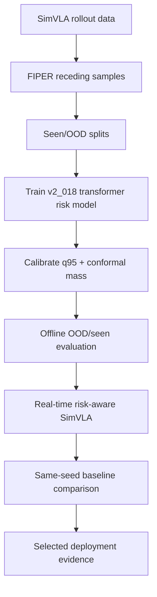

# FIPER Risk-Aware Report

> [!abstract]
> This vault summarizes the FIPER risk-aware SimVLA work so far. It focuses on the selected positive result: the `v2_018_transformer_k16` risk detector used online with `risk_filtered_lowest_score_candidate_v2_strict_margin`.

## Reading Order

1. [[01 - Executive Summary]]
2. [[02 - Data Collection and Splits]]
3. [[03 - Architecture]]
4. [[04 - Training and Calibration]]
5. [[05 - Offline Experiments]]
6. [[06 - Real-Time Deployment]]
7. [[07 - Negative and Rejected Ideas]]
8. [[08 - Dean Uncertainty Features]]
9. [[09 - Glossary]]
10. [[10 - Next Steps]]
11. [[11 - Source Artifacts and Trust Checks]]

## Main Result

The selected risk-aware policy improved the 4-task real-time same-seed success rate from **54.3%** to **57.3%** over **1881 paired episodes**. The strongest task-level gain was on `libero_10_with_milk/task7`: **54.2% -> 62.4%**.

![[assets/four_task_success_rates.png]]

## End-to-End Map

