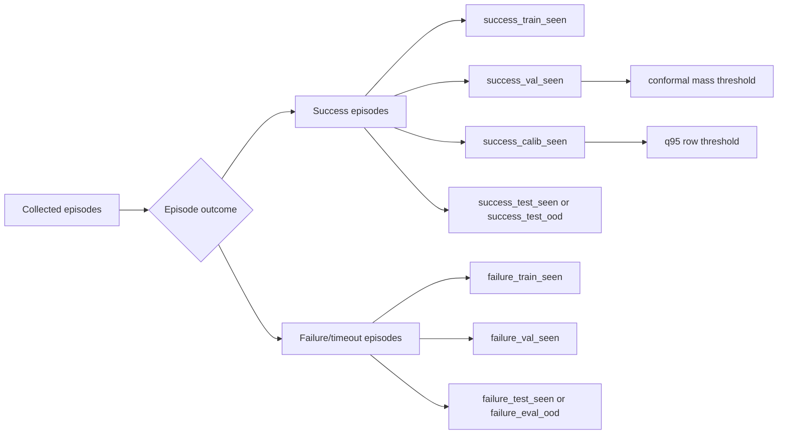

# Data Collection and Splits

## What Was Collected

FIPER converts SimVLA rollouts into temporal training rows. Each row describes one timestep in a rollout:

- current robot proprioception
- previous executed actions
- action chunk proposed by SimVLA
- ACE candidate chunks
- ACE metrics
- episode outcome label, success or failure/timeout

The current canonical FIPER combined dataset used for the selected baseline had **734,266 receding rows** after consolidation.

## What "Receding" Means

SimVLA predicts a chunk of future actions, but the standard control loop executes only the first action, then queries SimVLA again at the next step. This is called receding-horizon control.

## Split Families Tried

| Split family | Purpose | Train data | Eval data | Why it matters |
|---|---|---|---|---|
| `00_global_main` | General baseline | broad seen train/calib/val | general seen/OOD tests | used for `libero_10_with_milk/task7` real-time deployment |
| `01_ood_task_8_9` | Task-id OOD | train without task 8/9 | task 8/9 held out | used for `libero_10_with_milk/task8` deployment |
| `fold_00_holdout_alphabet_soup_bbq_sauce` | target-object OOD | excludes held-out objects | alphabet soup / BBQ sauce style object holdout | used for fold00 real-time seen/unseen object tasks |
| capacity/history sweep fold00 | model size sanity check | fold00 split | fold00 OOD eval | tested if bigger/smaller transformer improves |
| ACE sampling ablation fold00 | input-frequency ablation | fold00 split | fold00 OOD eval | tested if fewer ACE candidates improves false alarms |
| Dean all-tasks random | uncertainty feature sanity | all tasks randomized | seen test | asks if uncertainty features help on in-distribution tasks |
| Dean last-two task-id OOD | clean OOD with all episodes | last 2 task ids held out | OOD success/failure | asks if uncertainty features help on OOD task ids |

## Split Flow

## Leakage Rules

The selected detector must not use:

- reward
- success flag
- future timesteps
- visual object poses
- task metadata as model input
- OOD rows for training in OOD experiments
