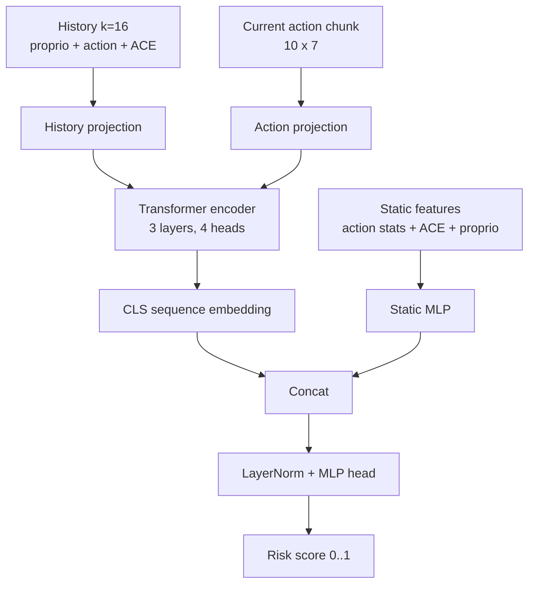

# Architecture

## Selected Model

`v2_018_transformer_k16` is a sequence transformer risk model.

| Parameter | Value |
|---|---:|
| history window | 16 timesteps |
| sequence model | transformer encoder |
| width | 128 |
| layers | 3 |
| heads | 4 |
| dropout | 0.1 |
| output | scalar risk score |

## Inputs

The model receives three feature groups:

1. **History tokens:** previous proprioception, previous executed actions, previous ACE metrics.
2. **Action tokens:** current SimVLA candidate action chunk.
3. **Static features:** action statistics, ACE metrics, current proprioception.

## Architecture Diagram

## Why A Temporal Model

A single action can look risky in isolation, but failures often emerge from a sequence: repeated drift, unstable candidate chunks, or mismatch between action proposals and proprioceptive history. The transformer sees a short history window and can detect these temporal patterns.

## Output Meaning

The output is a risk score. Higher score means the current state/action context resembles trajectories that later fail. It is not a calibrated probability of task failure by itself; it becomes actionable only after threshold calibration.
