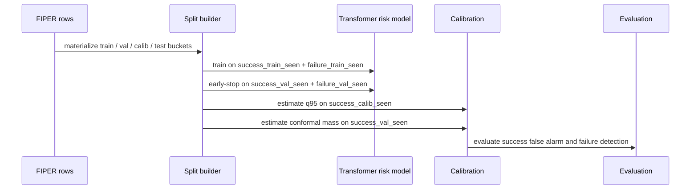

# Training and Calibration

## Training Objective

The model is trained as a binary risk classifier:

- label `0`: row comes from a successful episode
- label `1`: row comes from a failure/timeout episode

The practical objective is not only high accuracy. The detector must keep success false alarms low while detecting failures early enough to matter.

## Training Pipeline

## Calibration

Two thresholds are used:

| Threshold | Data used | Meaning |
|---|---|---|
| `q95` | `success_calib_seen` rows | row-level threshold; only the top 5% success-like risk scores should exceed it |
| conformal mass | `success_val_seen` episodes | episode-level accumulated evidence threshold |

The online alarm logic accumulates score excess above `q95`:

$$
mass_t = \sum_{i=1}^{t} \max(0, score_i - q95)
$$

An episode is flagged when `mass_t` exceeds the calibrated conformal mass threshold.

## Why Not Use Failures For Calibration

Success-only calibration protects false alarm control: it asks "how much risk mass do successful episodes naturally generate?" Failures are used to train and validate the detector, but not to define the success false-alarm threshold.
