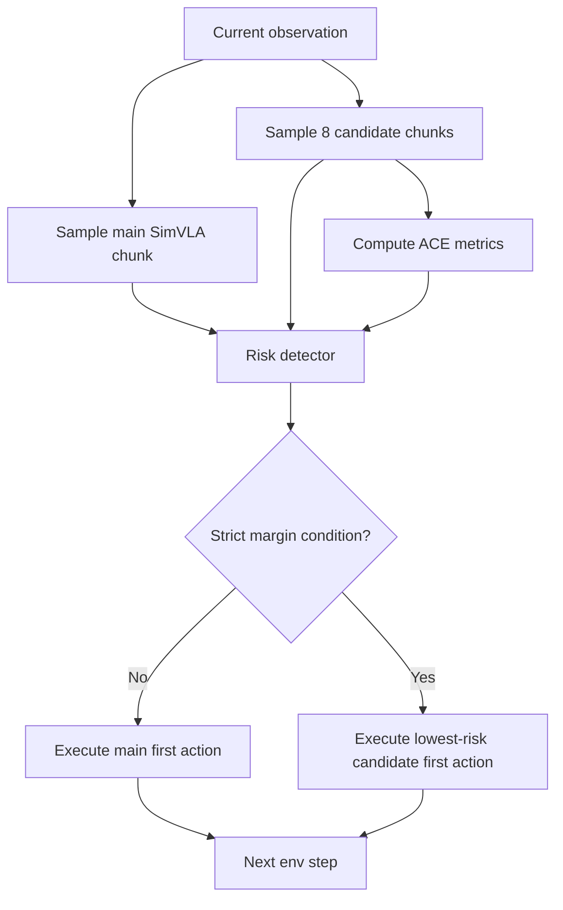

# Real-Time Deployment

## Deployment Policy

The real-time policy tested on Bob/Sam was:

`risk_filtered_lowest_score_candidate_v2_strict_margin`

At each timestep:

1. Sample the normal/main SimVLA action chunk.
2. Sample 8 extra candidate chunks with unique random seeds.
3. Compute ACE from the candidate set.
4. Score main and candidate chunks with the risk detector.
5. If strict margin rules pass, execute the lowest-risk candidate.
6. Otherwise execute the normal main action.

## First Task7 Test

![[assets/task7_first_realtime.png]]

| Metric | Baseline | Risk-aware |
|---|---:|---:|
| Episodes | 100 | 100 |
| Success rate | 58.0% | 61.0% |
| Recoveries | - | 25 |
| Regressions | - | 22 |
| Mean modifications / episode | - | 18.68 |

Runtime cost was high:

![[assets/task7_timing_slowdown.png]]

| Runtime metric | Baseline | Risk-aware |
|---|---:|---:|
| estimated parallel elapsed | 0.88 h | 7.66 h |
| slowdown | | 8.68x |

## Four-Task Same-Seed Test

![[assets/four_task_success_rates.png]]

| Task | Episodes | Baseline | Risk-aware | Delta |
|---|---:|---:|---:|---:|
| `libero_10_with_milk/task7` | 450 | 54.2% | 62.4% | +8.2 pts |
| `libero_10_with_milk/task8` | 429 | 49.0% | 49.7% | +0.7 pts |
| fold00 seen butter task2 | 450 | 38.2% | 40.9% | +2.7 pts |
| fold00 unseen alphabet soup task0 | 552 | 71.6% | 72.3% | +0.7 pts |
| **global** | **1881** | **54.3%** | **57.3%** | **+3.0 pts** |

![[assets/four_task_success_delta.png]]

## Recoveries and Regressions

![[assets/recoveries_vs_regressions.png]]

| Task | Recoveries | Regressions |
|---|---:|---:|
| task7 seen | 80 | 43 |
| task8 OOD | 81 | 78 |
| fold00 seen butter | 31 | 19 |
| fold00 unseen alphabet soup | 14 | 10 |

## Modification Rate

![[assets/modification_stats.png]]

The modification rate matters because too many interventions can slow down or perturb a trajectory. The selected v2 strict policy is much less aggressive than the first v1 smoke, but it still creates regressions.

## Pairing Caveat

The 4-task comparison is exact for reset seed order. The baseline also reused risk-aware main action seeds when available. If the baseline episode ran longer than the risk-aware episode, it generated fallback action sampling seeds after the risk-aware trace ended. This is a caveat for per-timestep action-seed equality, not for reset-seed pairing.
